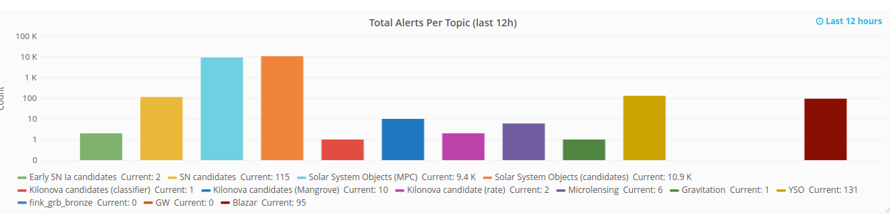
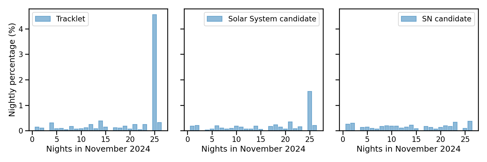
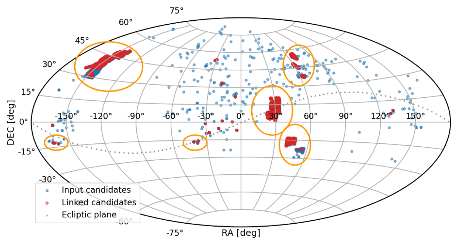
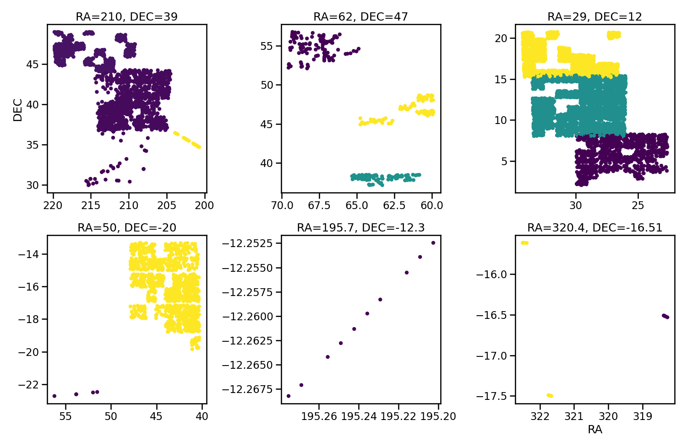
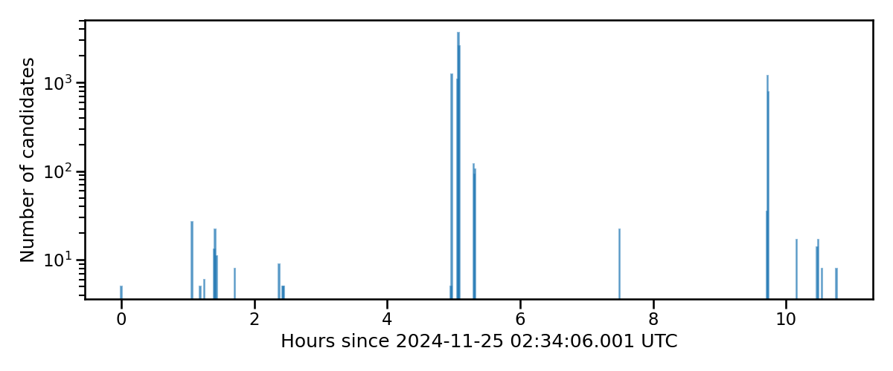
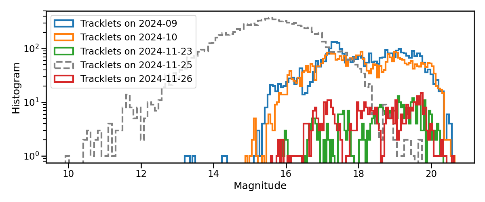
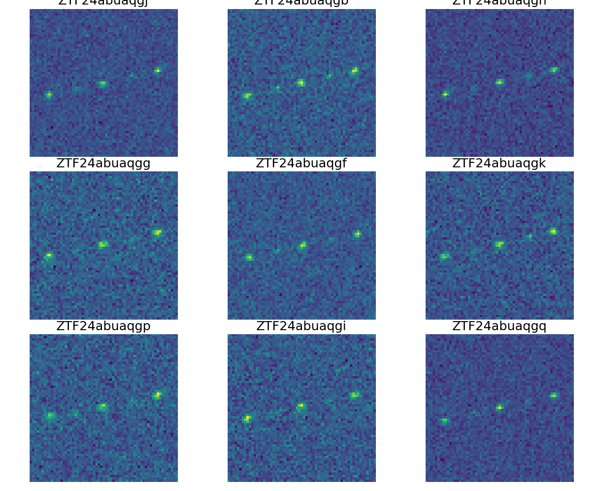
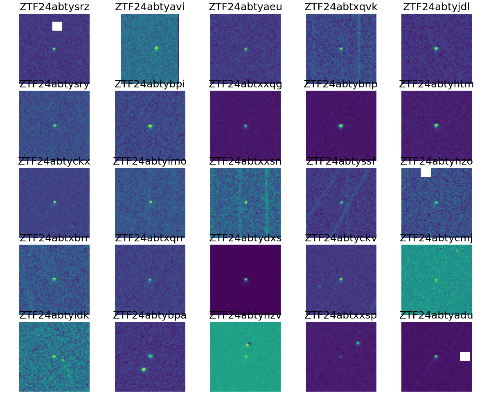
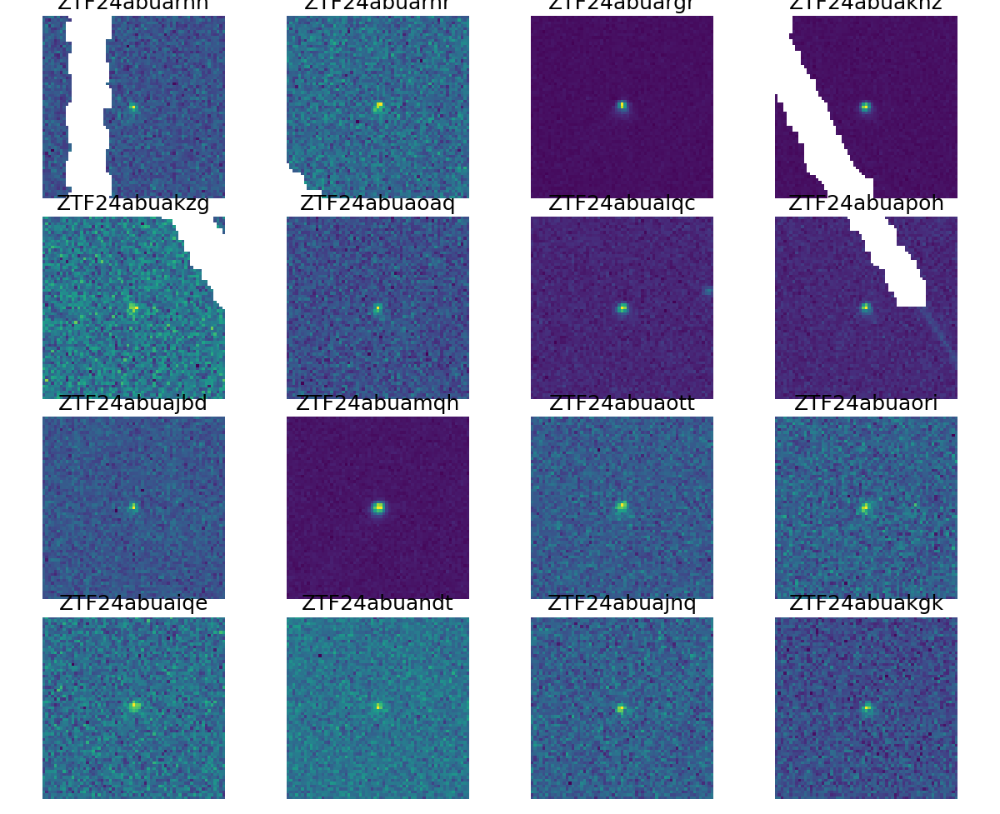
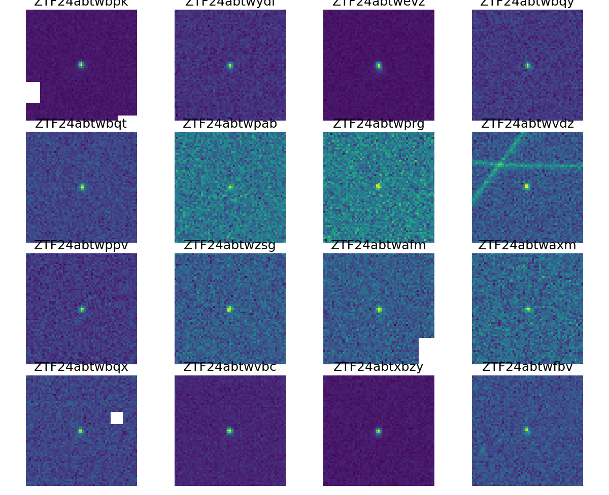

# 2024-11-25: what was that?

> [!NOTE]
> On the night of November 25, 2024 (`nid` 2885), we observed a rise in unknown moving objects in Fink from the ZTF public alert stream. 

Here is a screenshot of our night monitoring dashboard during operations:



The orange bar (labeled as "Solar System Object candidate"—though it should really be called "Moving Object candidate") is peaking at over 10,000 objects collected, while it usually peaks at around 100 objects per night. If we take a closer look at all the nights in November, we can clearly see that [Tracklets](https://fink-broker.readthedocs.io/en/latest/services/search/tracklet/) and [Solar System Object](https://fink-broker.readthedocs.io/en/latest/services/search/solar_system/#candidate-solar-system-objects) candidates surged on that night:



## Tracklet candidates

At the end of the night, we process each exposure one by one to extract fast-moving objects, as described in [Karpov and Peloton 2023](https://arxiv.org/abs/2310.17322). The algorithm has a complexity of $N^3$, where $N$ is the number of input objects, and the memory usage increases with a similar scaling. Needless to say, Fink went nuts -- we had to urgently devise a method to process such a large and unexpected volume of candidates, peaking at 35 GB of RAM for a single exposure with 4,000 candidates! We finally obtained 11,079 alerts grouped in 2,245 unique tracklet candidates. Once the surprise has passed, let's inspect the output of the processing.

### Sky map 

Here is the position on the sky of all the input candidates (blue) and the successfuly linked candidates (red, also called tracklets):



For reference we also depict the ecliptic plane with a dotted line. Let's notice a few overdense zones. Let's zoom on some of zones of interest:



For each subplot, the zone is color coded by exposure time(s) (and different zones correspond to different times by construction). The four first zones (left to right, top to bottom) show overdense regions of alerts, while the last two zones show more regular tracklet patterns. 

> [!WARNING]
> Looking at the overdense regions, it is easy to understand why the tracking algorithm went nuts! It was not designed for that density of objects, and the number of false positive must be huge.

### Time of observations

Here is the histogram of number of tracklets as a function of time for that night:



It is difficult to conclude as this distribution also depends on the observing schedule of ZTF, but clearly something already happened by 7 UTC.

### Magnitude distribution



This plot shows the magnitude distribution of Tracklets in Fink for various periods: September 2024 (blue), October 2024 (orange), November 23, 2024 (green), November 25, 2024 (dashed grey), and November 26, 2024 (red). Clearly, the objects from November 25, 2024, are different from the usual Tracklet population observed by Fink every night.

### Cutouts: the usual satellite glints

If we look at cutouts from the zones with a normal density of objects (see zone plot above), we find the usual glint pattern described in [Karpov and Peloton 2023](https://arxiv.org/abs/2310.17322):



### Cutouts: the unusual

However if we look at cutout from the overdense regions, they do not look like the usual glinting satellites: single detection, with often bright tracks around.








## Nature of this event?

Questions remained: what could have caused the rise of Moving Object candidates in Fink? Why are they clustered in overdense regions? 

### Starlink launch close: coincidence? 

From [https://www.spacex.com/launches/](https://www.spacex.com/launches/), we can read that there were Starlink launches on November 23 and November 25, 2024. The second one was launched on November 25 at 5:02 a.m. ET, that is 10:02 a.m. UTC -- so this can't be related. The first one was launched on November 23 at 9:25 p.m. PST -- that is November 24 at 05:25 a.m. UTC, 24h before we spot our rise of events. It could be related. 

> [!NOTE]
> Though there were many Starlink launches in the past, we were never affected in this way. Note that we usually do not receive direct satellite contamination, as bright tracks are removed by ZTF before alert generation. That's why we typically only observe more subtle contributions from glinting satellites or debris (above magnitude 16).

### So what?

The nature of this event (if it is a single event) and these alerts remains open: uncontrolled turns of events during a Starlink launch? In-flight collision? Something else?

As with everything in Fink, the Tracklet data is open data. We provide a script to download it. Just execute:

```bash
python download_tracklet_data.py
```

You will get Tracklet data saved in a Parquet file. You can easily explore the data using e.g. Pandas. If you are unsure about the meaning of the columns, check the [schema](https://fink-broker.readthedocs.io/en/latest/services/search/definitions/) page. Also, if you want to access image cutout data, you can use the [cutout API](https://fink-broker.readthedocs.io/en/latest/services/search/imagesearch/) as usual. However, as there are many candidates (about 11k), this can be a time consuming operation (about 0.3 second/cutout), so we made an extraction for you that can be accessed at this [link](https://box.in2p3.fr/s/xz7NAMKcDRyP8yG) (150MB).

**We would be happy to hear your opinions and analyses on this!**
